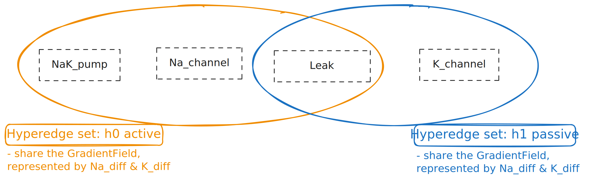

# Overview & Hypergraphs

This project uses a hypergraph to represent how proteins control the movement of ions in/out of a cell (called an electrochemical gradient). It is an incredibly simple toy representation of this dynamic, and is meant to provide *some* scaffold for more interesting iterations. 

Hypergraphs are graphs with the property that edges can contain any number of nodes. This may be useful for a system or network-like model where we want to computationally represent multiple nodes in a single connection.

# Implementation
In this example the **nodes** are receptors/channels/pumps, and **hyperedges** carry a qualitative gradient state. The below diagram is useful for visualizing hypergraphs. You will see more like this if you search online. As a graph, this is technically extending just one piece of usual graph, however as more nodes are added and variations in the sets included in hyperedges (and the impact on the gradient the hyperedge carries), this can get pretty complicated. Here the black boxes are nodes in the graph, and the ovals are the hyperedges: 

 

These are created in `main.cpp`: 
- Receptors: `Na_channel`, `K_channel`, `Leak`
- Pump: `NaK_pump`
- Hyperedges:
  - `h0_active` (`ActiveEdge`) with `Na_channel, Leak` + pump
  - `h1_passive` (`PassiveEdge`) with `K_channel, Leak`

## Step Phases

The sim in `main.cpp` advances one step at a time using `step()` in `hypergraph.cpp`.

Each step processes every hyperedge in order:
1. **State updates** occur first, when receptors read the local `GradientField` and update Open/Closed state. Pumps read `atp_available` and update Active/Inactive state.
2. **Passive channels** then run: open channels (`Na_channel`, `K_channel`, `Leak`) move the `NaDiff` and/or `KDiff` one unit positive or negative, whichever is in the direction of equilibrium.
3. **Active pumps** run: `ActiveEdge` has the active `NaK_pump` which will update gradients with `NaDiff += 1`, `KDiff -= 1`, against the equilibrium (ie opposite what passive is doing). This decrements `atp_available`, so it's capacity depends on the hardcoded amount of ATP (which also means in a mini toy example it stalls out)

4. **Adjusting local fields** `field.NaDiff` and `field.KDiff` by applying `delta`.

5. **Clamp** is finally called. The purpose, as named, is to keep the example within simple and interpretable limits

### The Hypergraph part 

The main point is that hyperedges feature an overlap. `Leak` is a **shared node** which belonds to both `h0_active` and `h1_passive`. Speaking in terms of the set, each hyperedge is a subset of nodes. The overlap means a non-empty intersection. In set notation,
  - `h0_active = {Na_channel, Leak, NaK_pump}`
  - `h1_passive = {K_channel, Leak}`
  - `h0_active ∩ h1_passive = {Leak}`

# Testing 

This is setup to be run similar to homeworks. After changing to the empty ```build``` directory and compiling, run:

```bash
./run_tests
```
The `tests/test.cpp` does 3 things:
- Test 1: Checking that `Leak` appears in both hyperedges
- Test 2: Runs 16 ticks and prints each tick
- Test 3: Prints final ATP and final edge fields

## Sample output

```
test 1: wiring
  Leak appears in h0_active and h1_passive: yes

test 2: ticks
tick 0 | h0_active NaDiff=3 KDiff=-3 | h1_passive NaDiff=3 KDiff=-3 | ATP=10
tick 1 | h0_active NaDiff=2 KDiff=-3 | h1_passive NaDiff=2 KDiff=-1 | ATP=9
tick 2 | h0_active NaDiff=1 KDiff=-3 | h1_passive NaDiff=1 KDiff=1 | ATP=8
tick 3 | h0_active NaDiff=0 KDiff=-3 | h1_passive NaDiff=0 KDiff=-1 | ATP=7
tick 4 | h0_active NaDiff=1 KDiff=-3 | h1_passive NaDiff=0 KDiff=1 | ATP=6
tick 5 | h0_active NaDiff=0 KDiff=-3 | h1_passive NaDiff=0 KDiff=-1 | ATP=5
tick 6 | h0_active NaDiff=1 KDiff=-3 | h1_passive NaDiff=0 KDiff=1 | ATP=4
tick 7 | h0_active NaDiff=0 KDiff=-3 | h1_passive NaDiff=0 KDiff=-1 | ATP=3
tick 8 | h0_active NaDiff=1 KDiff=-3 | h1_passive NaDiff=0 KDiff=1 | ATP=2
tick 9 | h0_active NaDiff=0 KDiff=-3 | h1_passive NaDiff=0 KDiff=-1 | ATP=1
tick 10 | h0_active NaDiff=1 KDiff=-3 | h1_passive NaDiff=0 KDiff=1 | ATP=0
tick 11 | h0_active NaDiff=-1 KDiff=-2 | h1_passive NaDiff=0 KDiff=-1 | ATP=0
tick 12 | h0_active NaDiff=1 KDiff=-1 | h1_passive NaDiff=0 KDiff=1 | ATP=0
tick 13 | h0_active NaDiff=-1 KDiff=0 | h1_passive NaDiff=0 KDiff=-1 | ATP=0
tick 14 | h0_active NaDiff=1 KDiff=0 | h1_passive NaDiff=0 KDiff=1 | ATP=0
tick 15 | h0_active NaDiff=-1 KDiff=0 | h1_passive NaDiff=0 KDiff=-1 | ATP=0
tick 16 | h0_active NaDiff=1 KDiff=0 | h1_passive NaDiff=0 KDiff=1 | ATP=0

test 3: final
  ATP_available=0
  h0_active  NaDiff=1 KDiff=0
  h1_passive NaDiff=0 KDiff=1
```

## Limitations and future directions

- **Qualitative gradients only:** the model is purely for demonstrative purposes. It only uses signed integers (ie. `NaDiff`, `KDiff`), no quantitative concentrations. Pursuing any semi-accurate quantitative approach also potentially changes how this is structured and is beyond scope. 
- **No explicit membrane potential:** voltage (`Vm`) is not modeled, it's inferred based on the concentrations. It could be explicitly added as well (and I may do that in the future). However another direction this could take would be to expand to all other ions and membrane proteins, just by adding them into the bio_types. After more are added the model could look across all ions and measure relative impact on Vm, too, however then the original linkage to Vm would need to be updated.   
- **Deterministic transitions:** The channels/pumps follow fixed rules, but something more accurate would include elements of stochastic influence or perhaps sources of noise to adjust the transitions themselves. 

There are many, many other reasons this is limited, and there are a lot of future directions to take this! The above are just a few.
